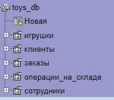

---
runme:
  id: 01HPQFD598WG75CA7DYRN7RG86
  version: v3
---

# Installation

## 1.Download and install project

```sh {"id":"01HPQFJWJ5RWG4AEDDC08FW2YD"}
git clone https://github.com/Shubnechkin-git/Toy-Warehouse-Information-Processing-System
cd Toy-Warehouse-Information-Processing-System
npm i
```

## 2.Import BD to PhpMyAdmin



## 3.Run project

```sh {"id":"01HPQFHWSBZ2FQP8SC0BTE9R3D"}
npm start
```
